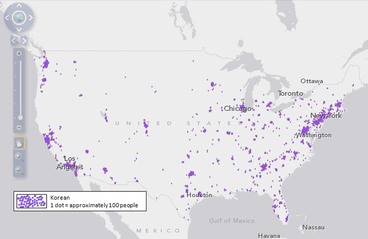
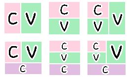

# Core Requirement

## Language Overview

Korean is a SOV (subject-object-verb) language. The relative order of words in a sentence is fixed, but both the subject and object can be dropped (and become implied) from a sentence.
나 밥 먹었어
(*I rice ate*)

Adjectives are pre-pended to the noun that they modify, and can be appended in series.
빨간 사과
(*red apple*)

## Inflectional Morphology

The modern system of classifying Korean words uses 9 parts of speech. Words do not have grammatical gender.

### Substantitives (category of nouns):
Substantives are subdivided into nouns, pronouns, and numerals. Nouns are made plural with a suffix 들 (*deul*), but only when the plurality of the modified noun is not contextually known.

There are two sets of numerals, one native Korean and one Sino-Korean (based on the Chinese numerals). There is a distinction made between the two systems, where each countable should be expressed with only one of the two systems.

Pronouns are differentiated by level of politeness. There are no formal 3rd person pronouns used. Instead, level of formality is implied by context in the sentence.

|     | Singular                             | Plural                       |
|-----|--------------------------------------|------------------------------|
| 1st | 나 (*na*), 저 (*jeo*)                | 우리 (*uri*), 저희 *jeohui*) |
| 2nd | 너 (*neo*)                           | 너희 (*neohui*)              |
| 3rd | 그 (*geu*, he)/그녀 (*geunyeo*, she) | 그들 (*geudeul*)             |

### Verbs:
Verbs are inflected for tense:

- 너 밥 먹고있어?
*You meal eating?*

- 너 밥 먹었어?
*You meal ate?*

Verbs are also inflected for written/spoken language:

- (Spoken language) 밥 먹었어
*Meal ate*

- (Written language) 밥 먹었다
*Meal ate*

Verbs are separated into processual verbs (action verbs) and descriptive verbs:

- 붉다 *bukda*, "to be red"

Both verbs and nouns inflect for politeness:

- (Casual) 야, 밥 먹어.
*Hey, meal eat*

- (Polite) 진지 잡수세요.
*Meal eat*

## Speakers
Korean is the official language of South Korea, North Korea and China's Yanbian Korean Autonomous Prefecture, and is spoken by approximately 80 million people worldwide. Of those, about 51 million reside in South Korea, and about 7 million overseas (2013). Most of expatriates reside in the US, Japan, and China, where there are significant Korean cultural enclaves spanning multiple generations. For example, Koreans form 40% of Japan's non-ethnic Japanese population (about 900,000 people, 2005), and about 75% of those people were born in Japan. Additionally, there are small number of people who speak Korean in Mongolia Autonomous Region and Russian Federation region (Uzbekistan, Kazakhstan, and Primorsky Krai).

The distribution of Koreans living in America:

Korean dialects differ between North and various parts of South Korea. South Korea's Standard Korean was influenced by the Seoul dialect (though it doesn't include features eclusive to the Seoul region). Different regions of Korea have local dialects, as do Korean enclaves in Japan and China, which are influenced by the local language.

North and South Korean dialects are generally intelligible, though pronunciation, vocabulary, and grammar have diverged between the two. Notably, North Korea's vocabulary reflects the ideology of the culture and excludes anglicisms, instead using invented Korean words (for recently introduced words) or words that were instead borrowed from Russian.

## Korean Script

### History
The verbal Korean language has been existing as early as 18 BC when the age of Three Kingdoms began, where each kingdom had its own language system that slightly differed from each other. Upon the unification of Korean peninsula in late 7th century, the language that is most similar to current Korean language has been recognized as the official language.

Korean uses an alphabetical system known as Hangul, which was introduced in 15th century during Chosun Dynasty.
Up until then, there was no formalized alphabet system in Korean; rather, Chinese characters were used to communicate.
Chinese characters are traditionally ideograms, but were used in both semantic and phonetic ways to represent Korean grammar.
Additionally, only a small number of higher-class people learned to write Chinese characters and few people learned to read.
These factors resulted in a low literacy rate. To resolve this problem, King Sejong and his scholars introduced Hangul.

### Structure
Hangul is composed of 10 vowels and 14 consonants, which reprsent the basic vowels and consonants in the system.
Using the combinations of vowels and consonants, different vowels or consonants can be generated.
Vowels are invented by the 'Yin-Yang' idea. Specifically, 'basic vowels' are of the form '.', 'ㅡ', 'ㅣ'; each component represents sky (sun), earth or human.
Using combinations of three basic vowels, 10 vowels are created:
ㅏ (*a*), ㅑ (*ya*), ㅓ (*eo*), ㅕ (*yeo*), ㅗ (*o*), ㅛ (*yo*), ㅜ (*oo or u*), ㅠ (*you*), ㅡ(*eu*), ㅣ (*i*).
More complicated vowels can be generated by combinations of vowels (e.g., ㅐ, ㅒ, ㅔ, ㅖ, ㅘ, ㅙ, ㅚ, ㅝ, ㅞ, ㅟ, ㅢ).
Similarly, the 14 basic consonants are the following:
ㄱ (*g*), ㄴ (*n*), ㄷ (*d*), ㄹ (*l/r*), ㅁ (*m*), ㅂ(*b*), ㅅ (*s*), ㅇ (*ng*), ㅈ (*ch/j*), ㅊ (*ch*), ㅋ (*k*), ㅌ (*t*), ㅍ (*p*), ㅎ (*h*).

Syllables are generated through the combination of consonants and vowels.
Characters in a syllable block are read left-to-right and top-to-bottom.
There are 6 pre-determined allowable syllable structure (shown below).
Sequences of blocks are written left-to-right, and word tokens are delimited by spaces.
A morpheme or suffix is attached to the end of a word to add inflection.

Examples for each structure.

- 가 (ㄱ + ㅏ) (*ga*)
- 밥 (ㅂ + ㅏ + ㅂ) (*bab*)
- 오 (ㅇ + ㅗ) (*oh*)
- 복 (ㅂ + ㅗ + ㄱ) (*bok*)
- 왜 (ㅇ + ㅙ) where ㅙ is the combination between ㅗ and ㅐ (*wae*)
- 됐 (ㄷ + ㅙ + ㅆ) where ㅆ is the combination between ㅅ and ㅅ (*dw-ae-t*)

According to CIA the World Factbook, the literacy rate for the total population is 97.9%; male with 99.2% and female with 96.6%. Korea has many major publications throughout all sectors including books, newspapers, journals, websites, etc. There are no major impediments for literacy.

## MT Systems
Most machine translation systems support Korean (e.g., Google, Bing, and
Korean local web provider Naver).

The following paragrah is a translated excerpt from Wikipedia's article on Computer Science:
"There is a sub-field of computer science applications can be divided into purely theoretical and practical skills in the field of computer systems running on your computer. It is calculated as the basic properties and also some theoretical calculations to study the complexity of the problem is very abstract, and other computer graphics and it focuses on real-world applications. Another sub-field focuses on the calculation execution. For example, programming language theory and study the approach of calculation described above, the computer program itself study investigating different aspects of using the programming language and the complex system, human-computer interaction with the computer to calculate a useful and humans emphasis to easily create a universally accessible."

## NLP Research & Tools

There are many academics and professionals who conduct research on the Korean language. There is a group at Penn whose focus is Korean. Additionally, there are many domestic universities in Korea that run NLP / Machine Translation labs (e.g., [POSTECH](http://nlp.postech.ac.kr/), [KAIST](http://nlpcl.kaist.ac.kr/home/), and [SNU] (http://ids.snu.ac.kr/wiki/Intelligent_Data_Systems_Laboratory)).

There exist many NLP tools that allow people to computationally analyze the Korean language. Penn even has a Korean NLP group which consists of three main projects: Korean XTAG, Korean Treebank, and [Korean/English Machine Translation] (http://www.cis.upenn.edu/~xtag/koreantag/). Korean XTAG is an on-going project attempting to develop a Korean grammar using Feature-Based Lexicalized Tree Adjoining Grammar (LTAG) formalism. A Korean Treebank is a corpus annotated with morphological and syntactic information, similar to what we have seen in other treebanks. Korean Corpus is also available, which is retrieved mostly from the texts of military language training manuals. Along with Korean Corpus, the Part-of-speech tagging method is available.

The National Institute of the Korean Language (NIKL) also provides information on Corpus and morphological analysis through its website, and contains may open source resources such as KoKoMa NLP toolkit.

There is a Korean NLP package written in Python, called [KoNLP] (http://dm.snu.ac.kr/~epark/docs/2014-10-10-hclt.pdf). It provides the basic functionality of NLP analysis such as PoS tagging, and morphological analysis. The structure of the package resembles that of NLTK package, so it is relatively easy to use.

## Citations:
1. History of Korean Script:
Individual Letters of Hangeul and Its Principles. The National Institute of the Korean Language. Jan. 2008. <http://www.korean.go.kr/eng_hangeul/index.html>

2. Structure of Script:
The Background of Hangeul Invention. The National Institute of the Korean Language. Jan. 2008. <http://www.korea.go.kr/eng_hangeul/setting/001.html>

3. The Literacy Rate
People and Society :: KOREA, SOUTH. The World Factbook, The Central Intelligence Agency. 20. June. 2014. <https://www.cia.gov/library/publications/the-world-factbook/geos/ks.html>
